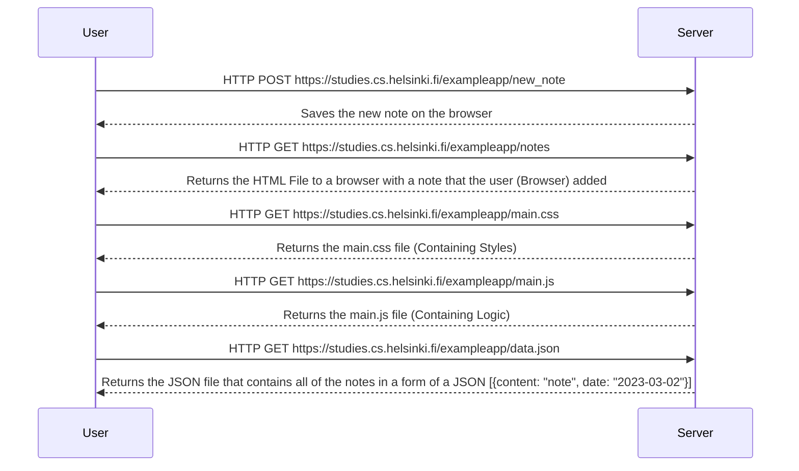

```mermaid
sequenceDiagram
Participant User
Participant Server

User->>Server: HTTP POST https://studies.cs.helsinki.fi/exampleapp/new_note
Server-->>User: Saves the new note on the browser
User->>Server: HTTP GET https://studies.cs.helsinki.fi/exampleapp/notes
Server-->>User: Returns the HTML File to a browser with a note that the user (Browser) added
User->>Server: HTTP GET https://studies.cs.helsinki.fi/exampleapp/main.css 
Server-->>User: Returns the main.css file (Containing Styles)
User->>Server: HTTP GET https://studies.cs.helsinki.fi/exampleapp/main.js
Server-->>User: Returns the main.js file (Containing Logic)
User->>Server: HTTP GET https://studies.cs.helsinki.fi/exampleapp/data.json
Server-->>User: Returns the JSON file that contains all of the notes in a form of a JSON [{content: "note", date: "2023-03-02"}]
```
