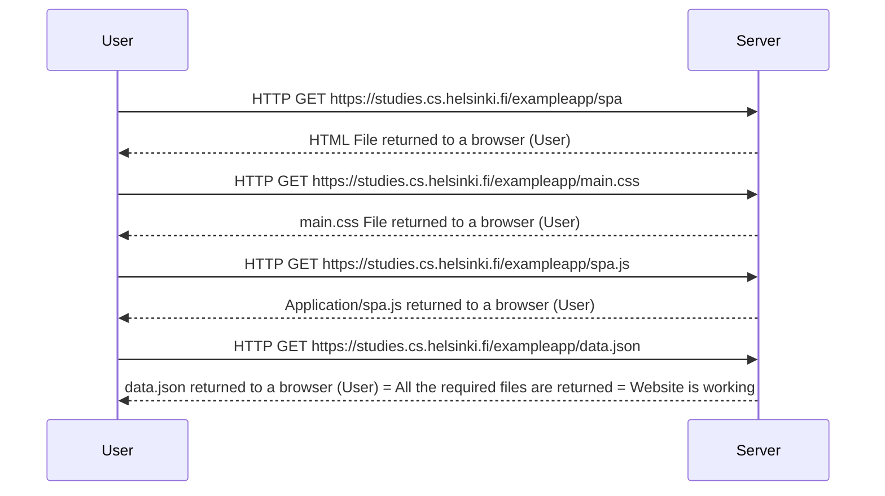

```mermaid
sequenceDiagram
Participant User
Participant Server

User->>Server: HTTP GET https://studies.cs.helsinki.fi/exampleapp/spa
Server-->>User: HTML File returned to a browser (User)
User->>Server: HTTP GET https://studies.cs.helsinki.fi/exampleapp/main.css
Server-->>User: main.css File returned to a browser (User)
User->>Server: HTTP GET https://studies.cs.helsinki.fi/exampleapp/spa.js
Server-->>User: Application/spa.js returned to a browser (User)
User->>Server: HTTP GET https://studies.cs.helsinki.fi/exampleapp/data.json
Server-->>User: data.json returned to a browser (User) = All the required files are returned = Website is working
```
